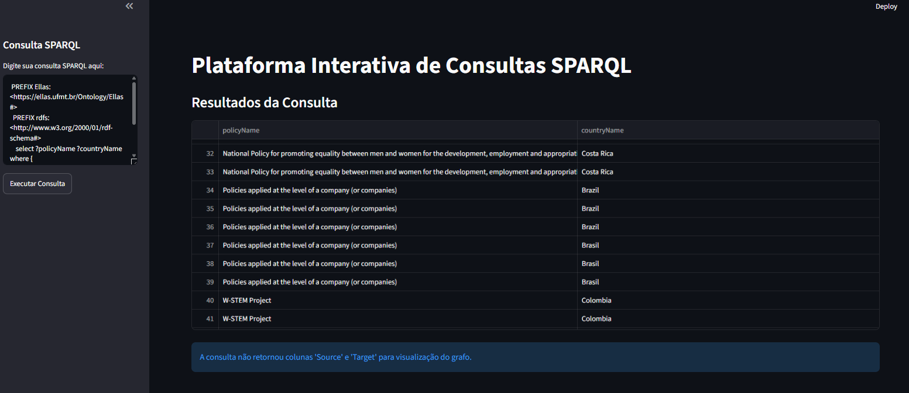

# Query Builder — Exploração Interativa do Grafo via SPARQL

Conjunto de aplicações Streamlit para consulta e visualização interativa do
grafo de conhecimento, complementando o [agente conversacional](../agente-llm)
com uma via de consulta direta — útil para validação manual de queries SPARQL
e exploração exploratória dos dados pela equipe técnica.



## Aplicações

| Arquivo | Descrição |
|---|---|
| `ConsultaSparql.py` | Editor livre: digite qualquer consulta SPARQL e veja o resultado em tabela (e em grafo, se houver colunas `Source`/`Target`). |
| `Teste.py` | Explorador por catálogo: selecione uma das *competency questions* pré-definidas (`sparql_queries.py`) em um menu, sem precisar escrever SPARQL. |
| `EllasBI.py` | Painel simples de indicadores: total de políticas por país, com gráfico de barras. |
| `sparql_queries.py` | Catálogo de *competency questions* com as consultas SPARQL correspondentes (Python). |
| `apiService.ts` | O mesmo catálogo de *competency questions*, em TypeScript, para integração com aplicações frontend (Axios). |

## Instalação

### Passo 1 — Dependências

```bash
pip install -r requirements.txt
```

### Passo 2 — Configuração

```bash
cp .env.example .env
```

Edite `.env` com a URL do seu repositório GraphDB e as credenciais de um
usuário com acesso de leitura.

### Passo 3 — Executar

```bash
streamlit run ConsultaSparql.py
# ou
streamlit run Teste.py
# ou
streamlit run EllasBI.py
```

Cada app sobe em `http://localhost:8501` (ajuste a porta se rodar mais de um
simultaneamente, com `--server.port`).

## Licença

Este componente segue a licença do repositório principal — veja
[LICENSE](../LICENSE).
