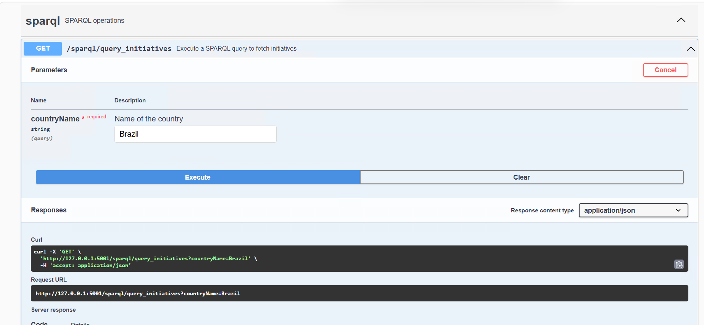

# Swagger — API REST de Exposição do Grafo (camada 4)

Implementação de referência da camada **Exposição por API** da arquitetura:
uma API REST em Flask (com [flask-restx](https://flask-restx.readthedocs.io/))
que executa consultas SPARQL fixas contra o GraphDB e expõe os resultados em
JSON, documentada automaticamente via Swagger/OpenAPI.

## Endpoints

| Rota | Parâmetro | Descrição |
|---|---|---|
| `GET /sparql/query_initiatives` | `countryName` (obrigatório) | Retorna as iniciativas cadastradas para o país informado. |
| `GET /sparql/query_policies` | — | Retorna todas as políticas cadastradas, com o respectivo país. |

A documentação interativa (Swagger UI) é gerada automaticamente pelo
flask-restx a partir das definições em `app2.py`.



> **Nota:** a rota `/` neste exemplo tenta renderizar um `templates/index.html`
> próprio (uma página inicial customizada usada na instância ELLAS), que não
> está incluído neste repositório. Para usar apenas a API e o Swagger UI
> gerado automaticamente, remova essa rota customizada ou acesse diretamente
> as rotas em `/sparql/...` e a documentação em `/swagger.json`.

## Instalação

### Passo 1 — Dependências

```bash
pip install -r requirements.txt
```

### Passo 2 — Configuração

```bash
cp .env.example .env
```

Edite `.env` com a URL do seu repositório GraphDB e as credenciais de um
usuário com acesso de leitura.

### Passo 3 — Executar

```bash
python app2.py
```

A API sobe em `http://localhost:5001`.

## Licença

Este componente segue a licença do repositório principal — veja
[LICENSE](../LICENSE).
